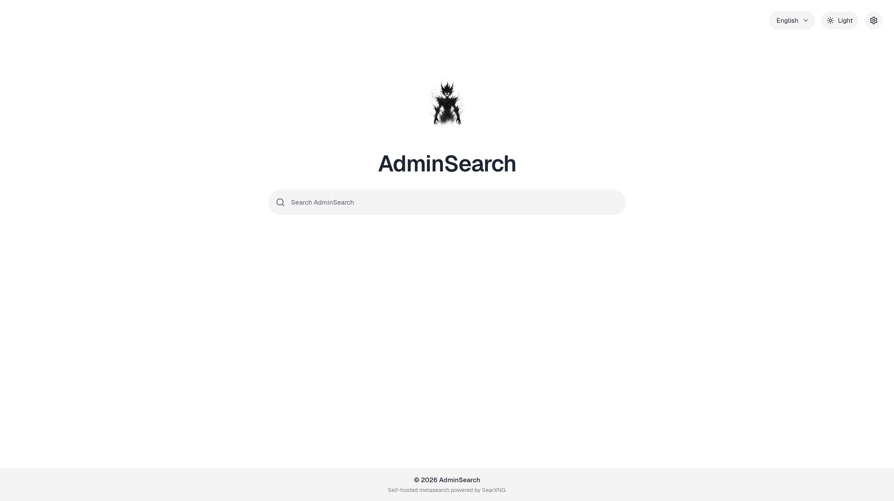

<p align="center">
  <h1>AdminSearch</h1>
  
</p>

AdminSearch is a self-hosted Next.js search frontend backed by a private
SearXNG instance. The browser never talks to SearXNG directly. All search and
autocomplete traffic goes through Next.js route handlers, which validate
requests, rate-limit them, normalize the response shape, and then call the
private SearXNG backend.

## Current standing

The app currently includes:

- a branded landing page at `/`
- a Google-like results page at `/search`
- tabs for `All`, `Images`, `Videos`, and `News`
- autocomplete suggestions in the shared search input
- instant answers and SearXNG infobox rendering
- exact app-level pagination at `20` results per page
- dark/light mode with `next-themes`
- shared header and footer

Video search currently supports:

- thumbnail previews in results
- hover-to-preview playback when the result exposes an embeddable preview URL
- fallback to static thumbnails when no usable preview URL exists

## Stack

- Next.js 16 App Router
- React 19
- TypeScript
- Tailwind CSS 4
- shadcn/ui
- Biome
- Lucide React
- `next-themes`
- `framer-motion`
- SearXNG
- Valkey
- Caddy

## Codebase structure

The frontend now uses a feature-first layout:

- `src/app`: route entrypoints only (`page.tsx`, `layout.tsx`, `route.ts`)
- `src/components/ui`: shadcn/ui primitives and app-wide baseline variants
- `src/components/site`: shared site chrome and branding
- `src/components/providers`: app-level providers used by the root layout
- `src/features/search`: search-specific UI, types, URL state helpers, and server logic
- `src/server`: shared server-only infrastructure
- `src/lib`: cross-feature utilities only

Search-specific implementation lives under `src/features/search`, while the App
Router files under `src/app` stay intentionally thin.

## UI and styling conventions

The styling model is intentionally layered:

- shadcn/ui primitives live in `src/components/ui`
- app-wide baseline refinements are added there as reusable variants
- feature-specific styling stays with the feature component that uses it
- page-specific refinements stay local to that page or feature caller

For example, the shared search bar on `/` and `/search` uses the same
feature-level `SearchInput` component, which is built on top of the shadcn
`Input` primitive instead of pushing search-specific behavior into the global
input component.

Tailwind CSS is the default styling mechanism for component-level work. Global
CSS is intentionally limited to theme tokens and base rules in
`src/app/globals.css`.

## Search architecture

Request flow:

1. Browser requests `/api/search` or `/api/autocomplete`
2. Next.js validates and normalizes input
3. Next.js rate-limits by client IP
4. Next.js calls private SearXNG over the internal/local network
5. SearXNG fans out to the configured search engines
6. Next.js returns a normalized frontend-friendly response

Forwarded client IP headers are only trusted when
`RATE_LIMIT_TRUST_PROXY_HEADERS=true`. Local development keeps this disabled so
direct requests cannot spoof `x-forwarded-for`. The production Compose stack
enables it for the Caddy-to-Next.js path and trusts one proxy hop by default.

Only these public app endpoints are used by the UI:

- `GET /api/search`
- `GET /api/autocomplete`
- `GET /api/health`

## Supported tabs

- `all`
- `images`
- `videos`
- `news`

Query params accepted by `/api/search`:

- `q`: required
- `tab`: `all | images | videos | news`
- `page`: positive integer
- `language`: optional language code
- `timeRange`: `day | month | year`
- `safeSearch`: `0 | 1 | 2`

## Current SearXNG engine set

General search:

- `bing`
- `brave`
- `duckduckgo`
- `google`
- `mojeek`
- `qwant`
- `startpage`
- `yahoo`
- `ddg definitions`
- `wikidata`
- `wikipedia`
- `wolframalpha`
- `yandex`

Image search:

- `bing images`
- `brave.images`
- `google images`
- `mojeek images`
- `qwant images`
- `startpage images`
- `duckduckgo images`
- `yandex images`

Video search:

- `bing videos`
- `brave.videos`
- `google videos`
- `qwant videos`
- `dailymotion`
- `duckduckgo videos`
- `youtube`

News search:

- `mojeek news`
- `startpage news`
- `wikinews`
- `bing news`
- `brave.news`
- `duckduckgo news`
- `google news`
- `qwant news`
- `reuters`
- `yahoo news`

## Autocomplete

Autocomplete is enabled in SearXNG with:

- active backend: `google`

Commented alternates kept in config:

- `brave`
- `duckduckgo`
- `bing`

The frontend uses a shared search input component on both `/` and `/search`:

- keyboard navigation with up/down arrows
- enter to pick a suggestion
- escape to close
- merged input + suggestion surface styling
- shared baseline styling with per-variant sizing (`hero` on `/`, `compact` on
  `/search`)

## Instant answers

AdminSearch currently supports:

- SearXNG built-in answer plugins
- DuckDuckGo definition-style instant answers via `ddg definitions`

Enabled SearXNG plugins:

- calculator
- hash
- self info
- unit converter
- time zone

## Local development

1. Install dependencies:

```bash
npm install
```

2. Copy envs:

```bash
cp .env.example .env.local
```

3. Start backend services:

```bash
docker compose up -d searxng-core valkey
```

4. Start the frontend:

```bash
npm run dev
```

App URLs:

- frontend: `http://localhost:3000`
- private SearXNG: `http://127.0.0.1:8080`
- private Valkey: `127.0.0.1:6379`

## Production stack

Production services:

- `nextjs`
- `searxng-core`
- `valkey`
- `caddy`

Run:

```bash
docker compose --profile prod up -d --build
```

Important envs:

- `NEXT_PUBLIC_APP_URL`
- `APP_DOMAIN`
- `SEARXNG_SECRET`
- `RATE_LIMIT_TRUST_PROXY_HEADERS`
- `RATE_LIMIT_TRUSTED_PROXY_HOPS`
- `SEARXNG_DNS_1`
- `SEARXNG_DNS_2`

## DNS

The SearXNG container uses explicit DNS resolvers because container-side DNS
resolution was failing earlier and caused empty search results.

Current defaults in `.env.example`:

- `SEARXNG_DNS_1=45.90.28.0`
- `SEARXNG_DNS_2=45.90.30.0`

## Useful commands

```bash
npm run dev
npm run lint
npm run format
npm run build
docker compose up -d searxng-core valkey
docker compose up -d --force-recreate searxng-core
```

## Notes

- SearXNG JSON output is enabled in `searxng/core-config/settings.yml`
- image and video thumbnails are loaded directly from remote sources
- video hover previews only work when the upstream result exposes an embeddable
  preview URL
- rate limiting falls back to in-memory storage if Valkey is unavailable
- `/search` is dynamic and query-driven; it is not a static search shell
- shared UI primitives are refined in `src/components/ui`, while search-specific
  behavior stays in `src/features/search`
