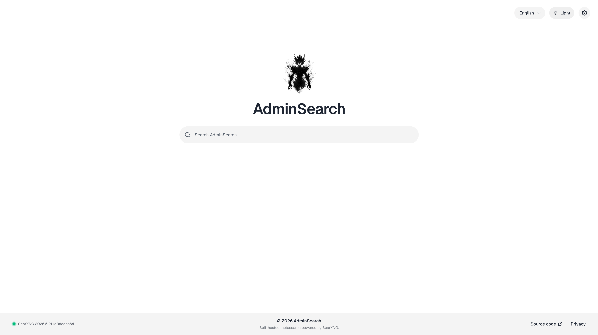
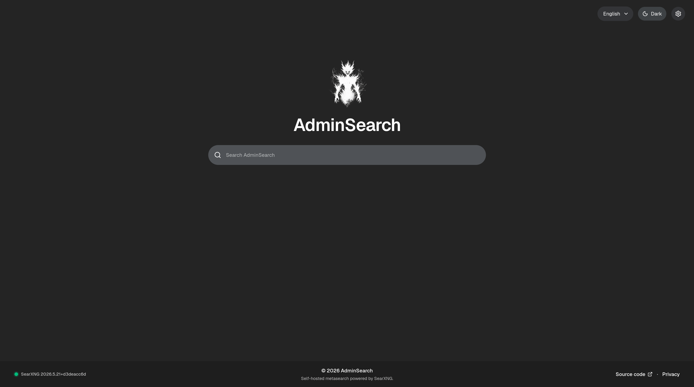

<div align="center">
  <h1>AdminSearch</h1>
  <p>
    AdminSearch is a self-hosted search frontend built with Next.js and backed
    by a private SearXNG instance. The browser talks to AdminSearch,
    AdminSearch talks to SearXNG, and the SearXNG backend handles the upstream
    search engines.
  </p>
  <p>
    The project focuses on a clean search experience with privacy-oriented
    defaults, server-side request handling, configurable engines, autocomplete,
    result tabs, theme support, and a Docker-based production setup.
  </p>
  <p>
    
    
  </p>
</div>

## Features

-  Search tabs for web, images, videos, and news
-  Autocomplete through the configured SearXNG backend
-  Settings for engines, language, theme, privacy, result behavior, and plugins
-  Server-side search proxying and response normalization
-  Redis/Valkey-backed rate limiting in production
-  SearXNG version visibility with upstream status checks
-  Light and dark themes via `next-themes` (with more coming)
-  Docker Compose stack for Next.js, SearXNG, Valkey, and Caddy

## Stack

- Next.js 16 App Router
- React 19
- TypeScript
- Tailwind CSS 4
- shadcn/ui and Radix UI
- Biome
- SearXNG
- Valkey
- Caddy

## Requirements

- Node.js compatible with Next.js 16
- npm
- Docker and Docker Compose
- A pinned SearXNG image digest for the Compose stack
- A pinned Valkey image digest for the Compose stack

## Getting Started

Install dependencies:

```bash
npm install
```

Create local environment files:

```bash
cp .env.example .env.local
```

For local development, either point `SEARXNG_INTERNAL_URL` at an existing
SearXNG instance or start the local backend services:

```bash
docker compose up -d searxng-core valkey
```

Start the Next.js dev server:

```bash
npm run dev
```

Open:

```text
http://localhost:3000
```

## Environment

The most important values are:

```text
NEXT_PUBLIC_APP_URL=http://localhost:3000
SEARXNG_INTERNAL_URL=http://127.0.0.1:8080
RATE_LIMIT_REDIS_URL=
SEARXNG_ENGINE_TOKENS=
SEARXNG_IMAGE_DIGEST=
VALKEY_IMAGE_DIGEST=
SEARXNG_SECRET=
```

For production, set the image digests and a generated `SEARXNG_SECRET`.
`RATE_LIMIT_REDIS_URL` should point to Valkey/Redis so rate limiting is shared
across server instances.

Forwarded proxy headers for rate limiting should only be trusted when the app is
behind a known reverse proxy. The Compose production stack is built for the
Caddy-to-Next.js path and enables that behavior there.

## Scripts

```bash
npm run dev      # start the local Next.js dev server
npm run build    # create a production build
npm run start    # run the production server
npm run lint     # run Biome checks
npm run format   # format the codebase
```

## Production

The production profile runs:

- Next.js
- SearXNG
- Valkey
- Caddy

Start it with:

```bash
docker compose --profile prod up -d --build
```

Before deploying, review `.env.example`, pin the image digests, set your domain,
and generate a strong `SEARXNG_SECRET`.

## Privacy

AdminSearch is designed to keep browser traffic pointed at your own frontend.
Search requests are handled server-side and forwarded to your private SearXNG
backend. Self-hosted instances can therefore keep search behavior under the
operator's control, depending on how the backend and upstream engines are
configured.
