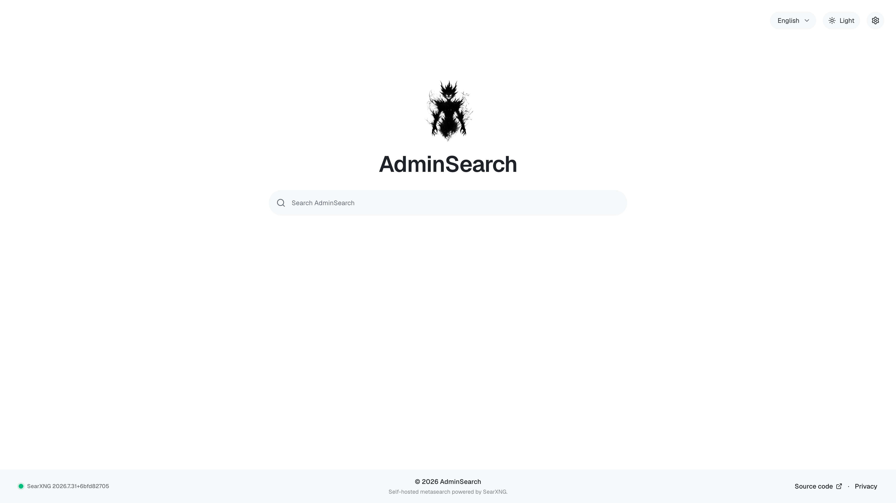
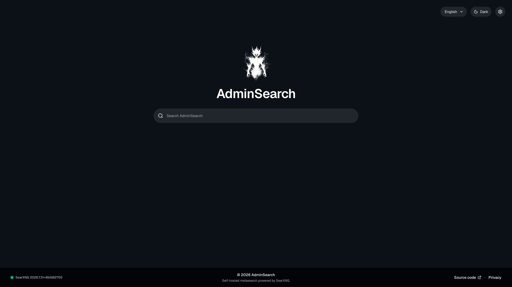

<div align="center">
  <h1>AdminSearch</h1>
  <p>
    A self-hosted search frontend built with Next.js and backed by a private
    SearXNG instance.
  </p>
  <p>
    &thinsp;
  </p>
</div>

## Features

- Web, image, video, and news search
- Configurable engines, language, privacy, and result behavior
- English and German interface localization
- Server-side SearXNG proxying
- Redis/Valkey-backed rate limiting
- Light, dark, and system appearance modes with
  [tracked named themes](./THEMES.md)
- Docker Compose setup for self-hosting
- Separate Docker images for Railway and similar platforms

## Stack

-  Next.js 16
- next-intl 4
-  React 19
-  TypeScript 7
-  Tailwind CSS
-  shadcn/ui
-  SearXNG
-  Valkey
-  Caddy

## Local development

Requirements:

- Node.js 22 and npm
- Docker and Docker Compose

Install the dependencies and create the environment file:

```bash
npm install
cp .env.example .env
```

Generate a secret with `openssl rand -hex 32` and assign it to
`SEARXNG_SECRET` in `.env`.

Start SearXNG and Valkey:

```bash
docker compose up -d searxng-core valkey
```

Start AdminSearch:

```bash
npm run dev
```

Open `http://localhost:3000`.

## Configuration

The main environment variables are:

```text
NEXT_PUBLIC_APP_URL=http://localhost:3000
SEARXNG_INTERNAL_URL=http://127.0.0.1:8080
RATE_LIMIT_REDIS_URL=
SEARCH_CONTINUATION_REDIS_URL=
VALKEY_IMAGE=docker.io/valkey/valkey:latest
SEARXNG_SECRET=
SEARXNG_OUTGOING_PROXY_URLS=
```

See `.env.example` for all available settings. The custom SearXNG image is
built from `docker.io/searxng/searxng:latest`, including whenever the Compose
stack starts; the Railway Dockerfile uses the same unpinned base image.

`SEARXNG_OUTGOING_PROXY_URLS` is optional. Set it to a newline-separated list
of trusted `http://`, `https://`, `socks5://`, or `socks5h://` proxy URLs.
SearXNG distributes requests across the configured pool and uses another proxy
when retrying an HTTP failure. Proxy credentials remain in runtime-only
configuration and are never written to source control or application logs. The
proxy operator can observe outbound search traffic, so use a provider you
trust.

`SEARCH_CONTINUATION_REDIS_URL` stores opaque pagination continuations in a
shared Redis/Valkey instance. When it is empty, AdminSearch reuses
`RATE_LIMIT_REDIS_URL`; when neither value is configured, a bounded
process-local store keeps single-instance development working.

## Self-hosting

Set `NEXT_PUBLIC_APP_URL` and `SEARXNG_SECRET` in `.env`, then run:

```bash
docker compose up -d --build
```

The stack includes AdminSearch, SearXNG, Valkey, and Caddy. Caddy binds to
`127.0.0.1:80` by default. Set `PUBLIC_BIND_ADDRESS=0.0.0.0` only when the host
port should be reachable from outside the server.

Update the service images with:

```bash
docker compose pull valkey caddy
docker compose build --pull searxng-core nextjs
docker compose up -d
```

## Railway

Create three services in one Railway project:

- `adminsearch`: this repository using the root `Dockerfile`
- `searxng-core`: this repository using `/searxng/Dockerfile`
- Redis: Railway's managed Redis service

Configure `adminsearch`:

```text
NEXT_PUBLIC_APP_URL=https://<your-domain>
SEARXNG_INTERNAL_URL=http://searxng-core.railway.internal:8080
RATE_LIMIT_REDIS_URL=${{Redis.REDIS_URL}}
RATE_LIMIT_TRUST_PROXY_HEADERS=true
RATE_LIMIT_TRUSTED_PROXY_HOPS=1
```

Set `NEXT_PUBLIC_APP_URL` before the image is built because Next.js embeds it
during the production build. Replace `Redis` in the reference if the managed
service has a different name.

Configure `searxng-core`:

```text
SEARXNG_SECRET=<generated-random-secret>
SEARXNG_PORT=8080
SEARXNG_BIND_ADDRESS=::
SEARXNG_OUTGOING_PROXY_URLS=<optional-multiline-secret>
SEARXNG_OUTGOING_RETRIES=1
SEARXNG_OUTGOING_EXTRA_PROXY_TIMEOUT=10
```

Add one proxy URL per line to the Railway multiline variable. Do not commit
proxy credentials to the repository. If the variable is empty, SearXNG uses
Railway's normal outbound network without a proxy.

On Railway Pro, enable Static Outbound IPs for `searxng-core` and redeploy the
service. Railway assigns multiple permanent IPv4 addresses and balances
outbound connections across them:

```bash
railway outbound-network static-ip enable --service searxng-core
railway redeploy --service searxng-core --yes
```

The Railway IP pool is small and its addresses may be shared with other
customers, so it reduces dependence on one egress IP but cannot guarantee that
search engines will not present CAPTCHAs. Use the optional proxy pool when more
egress diversity is required.

Only generate a public domain for `adminsearch`. Keep `searxng-core` and Redis
private. Caddy is only used by the self-hosted Compose stack.

## Scripts

```bash
npm run dev
npm run typecheck
npm run build
npm run start
npm run lint
npm run format
```

## Privacy

Browser search requests go through AdminSearch to the configured private
SearXNG backend. AdminSearch does not require user accounts, tracking profiles,
or client-side analytics.
